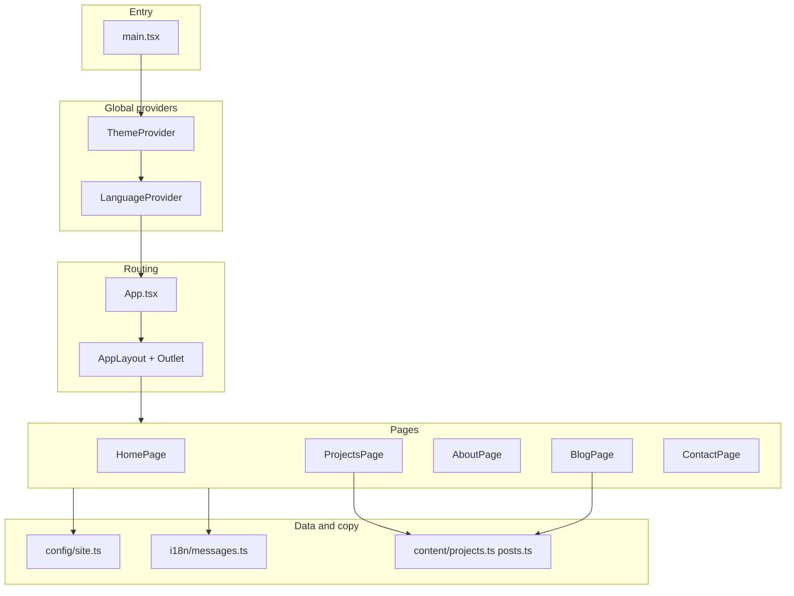

# Front-end — architecture and conventions

This document describes how the web app in [`apps/web`](../) is organized, key architectural choices, and conventions for safe evolution of the codebase.

## Stack

| Layer | Technology |
|-------|------------|
| Build / dev server | [Vite](https://vite.dev/) 8 |
| UI | [React](https://react.dev/) 19 |
| Language | [TypeScript](https://www.typescriptlang.org/) 5 (strict mode) |
| Routing | [React Router](https://reactrouter.com/) 7 (`createBrowserRouter`, `RouterProvider`) |
| Styling | [Tailwind CSS](https://tailwindcss.com/) 4 via `@tailwindcss/vite` |
| Lint | ESLint 9 + TypeScript ESLint |

There is no remote data layer in the front-end: static content in TypeScript and UI copy centralized in i18n.

## Layered view

- **Entry**: mounts the React tree, imports global styles, and nests providers in the correct order.
- **Providers**: theme (light/dark) and locale (EN/PT) wrap the entire app.
- **Routing**: `App.tsx` declares routes; the *layout* shares header and footer via `Outlet`.
- **Pages**: compose sections and components; they do not own infrastructure concerns (HTTP, etc.).

## Folder structure (`src/`)

| Path | Responsibility |
|------|------------------|
| `App.tsx` | `createBrowserRouter` definition and layout child routes. |
| `main.tsx` | `createRoot`, `StrictMode`, provider order. |
| `index.css` | Tailwind v4, `@theme` variables, class-based `dark` variant, base styles. |
| `config/site.ts` | **Non-translated** config: brand, logo initials, email, social URLs. |
| `content/` | Typed portfolio and blog data (`projects.ts`, `posts.ts`) — easy to swap for a CMS later. |
| `context/` | `theme-context` + `ThemeProvider`; `language-context` + `LanguageProvider` — context split from hooks where needed (ESLint react-refresh rule). |
| `hooks/` | `useTheme` — theme context consumer. |
| `i18n/` | `locale.ts` (allowed locales and `localStorage` key), `messages.ts` (`en` / `pt` objects with UI copy). |
| `components/layout/` | `AppLayout` (Outlet), `Header`, `Footer` — application shell. |
| `components/ui/` | Reusable primitives: `Button`, `Card`, `Input`, `Container`, etc. |
| `components/home/` | Home-specific sections (hero, philosophy, decorative code block). |
| `components/projects/` | `ProjectCard` and related pieces. |
| `pages/` | One logical module per route; orchestrate page layout and data. |

Import alias: `@/` → `src/` (see [`vite.config.ts`](../vite.config.ts) and `tsconfig.app.json`).

## Patterns in use

### 1. Application shell (nested layout)

A single parent route with `element: <AppLayout />` and child routes per URL. The layout renders `Header`, `Outlet` (active route content), and `Footer`. Benefits: consistent navigation, one link tree, no duplicated chrome across pages.

### 2. Separation of content vs. config vs. i18n

- **`site.ts`**: identity and links that do not change with locale (or that you choose to keep fixed).
- **`messages.ts`**: UI strings and long-form copy in **English** and **Portuguese**; `LanguageProvider` exposes `messages` for the active `locale`.
- **`content/`**: typed lists (projects, posts) decoupled from presentation.

This separation avoids mixing translation with structured data and eases a future move to a CMS or API.

### 3. Theme (light / dark)

- State lives in `ThemeProvider`; persistence in `localStorage`.
- `dark` class on `document.documentElement`; Tailwind uses `@custom-variant dark (&:where(.dark, .dark *))`.
- Inline script in `index.html` reduces incorrect theme flash on first paint.

### 4. Internationalization (i18n) without a heavy library

- React context (`LanguageContext`) + `messages[locale]` object.
- `document.documentElement.lang` and `document.title` update when the locale changes.
- Language switcher in `Header` (accessible dropdown with `role="listbox"` / `role="option"` where applicable).

For larger scope later, you can migrate to `react-i18next` or similar while keeping the same key structure.

### 5. Presentational UI components

Components under `components/ui/` take props and classes; they do not fetch data. Button variants (`primary`, `outline`, `ghost`) and containers (`Container` with max-width aligned to the design) centralize visual decisions.

### 6. Accessibility and UX

- Global visible focus via `:focus-visible`.
- Mobile menu with `aria-expanded`, `aria-controls`, `body` scroll lock when open.
- Form labels and error messages (e.g. contact) tied to inputs.

### 7. TypeScript

- `strict`, `noUnusedLocals`, `noUnusedParameters` — reduces dead code and unused parameters.
- Exported types in `content/` and `i18n/locale.ts` for explicit contracts.

## Routes

| Path | Component |
|------|-----------|
| `/` | `HomePage` |
| `/projects` | `ProjectsPage` |
| `/about` | `AboutPage` |
| `/blog` | `BlogPage` |
| `/contact` | `ContactPage` |

SPA: in production, the HTTP server must serve `index.html` for these paths (**fallback**) to avoid 404 on direct refresh or deep links.

## Testing

- **End-to-end**: Playwright specs live in `e2e/` next to the app root. They cover navigation, theme, locale, and the contact form against the Vite dev server (or a URL you provide). How to run tests, env vars, and CI notes are in [E2E.md](./E2E.md).
- **Unit / component**: not configured yet; Vitest (or similar) is a good fit for logic and isolated components without a full browser.

## Design tokens (Tailwind)

Defined in `index.css` under `@theme`: `--color-primary`, `--color-ink`, `--color-surface`, `--color-night`, `--font-sans` (Inter), etc. Dark mode reuses the same tokens with `dark:` utilities.

## Out of scope for now

- API layer / React Query / server-side rendering.
- Unit or component test runner (e.g. Vitest) — E2E is documented in [E2E.md](./E2E.md).
- Per-route meta tags (advanced SEO) — optional via `react-helmet-async` or similar.

## How to extend

1. **New page**: add a component under `pages/`, register the route in `App.tsx`, add nav entry in `Header` and keys in `messages.ts` (both `en` and `pt`).
2. **New project or post**: extend types in `content/` and append entries to the arrays.
3. **Contact backend**: replace the mock in `ContactPage` with `fetch` or a form action, keeping client-side validation where appropriate.

---

*Last revision aligned with the `apps/web` package in the portfolio monorepo.*
