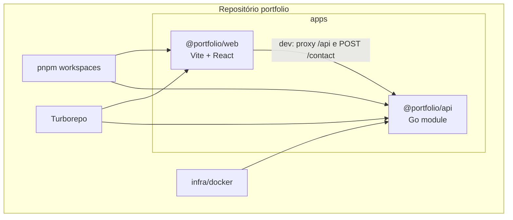
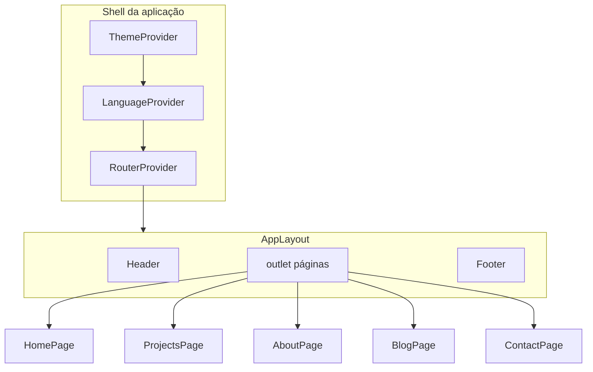
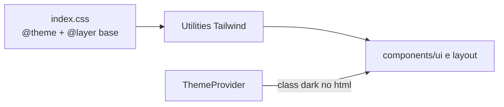
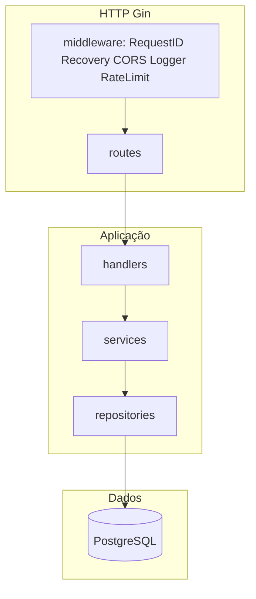
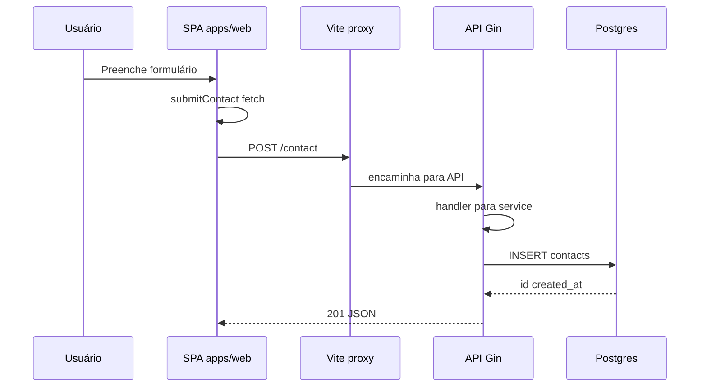

# Arquitetura do projeto

Documento de referência do monorepo **portfolio**: organização, tecnologias, fluxos e **design system** do frontend.

---

## Visão geral

O repositório agrupa um **SPA React** ([`apps/web`](../apps/web/)) e uma **API HTTP em Go** ([`apps/api`](../apps/api/)), com orquestração via **pnpm workspaces** e **Turborepo**, e ambiente containerizado opcional em [`infra/docker`](../infra/docker/).

---

## Stack de tecnologias

| Camada                | Tecnologia                                                    | Onde                                                                                                     |
| --------------------- | ------------------------------------------------------------- | -------------------------------------------------------------------------------------------------------- |
| **Frontend**          | React 19, TypeScript                                          | [`apps/web`](../apps/web/)                                                                               |
| **Build / dev (web)** | Vite 8, `@vitejs/plugin-react`, `@tailwindcss/vite`           | [`vite.config.ts`](../apps/web/vite.config.ts)                                                           |
| **Roteamento**        | React Router 7 (`createBrowserRouter`)                        | [`App.tsx`](../apps/web/src/App.tsx)                                                                     |
| **Estilos**           | Tailwind CSS 4 (`@import 'tailwindcss'`, `@theme`)            | [`index.css`](../apps/web/src/index.css)                                                                 |
| **Testes (web)**      | Vitest, Testing Library, Playwright (E2E)                     | [`vitest.config.ts`](../apps/web/vitest.config.ts), [`e2e/`](../apps/web/e2e/)                           |
| **Backend**           | Go 1.25+ (toolchain em [`go.mod`](../apps/api/go.mod)), Gin   | [`cmd/api/main.go`](../apps/api/cmd/api/main.go)                                                         |
| **Dados**             | PostgreSQL 16, `pgx/v5`, migrações em startup                 | [`internal/db`](../apps/api/internal/db/), [`internal/repositories`](../apps/api/internal/repositories/) |
| **API docs**          | Swagger / swag, `gin-swagger`                                 | [`/swagger`](../apps/api/cmd/api/main.go)                                                                |
| **Monorepo**          | pnpm 9, Turbo 2                                               | [`package.json`](../package.json), [`turbo.json`](../turbo.json)                                         |
| **CI**                | GitHub Actions (lint, test, build; integração API com Docker) | [`.github/workflows/ci.yml`](../.github/workflows/ci.yml)                                                |

---

## Frontend: arquitetura da aplicação

### Composição e roteamento

A árvore raiz envolve a aplicação com **tema** e **idioma** antes do roteador ([`main.tsx`](../apps/web/src/main.tsx)). As rotas são declaradas de forma centralizada com **layout aninhado** (`AppLayout` + páginas filhas).

### Camadas lógicas (convenção de pastas)

| Pasta                                                                                                           | Papel                                                                         |
| --------------------------------------------------------------------------------------------------------------- | ----------------------------------------------------------------------------- |
| [`src/pages/`](../apps/web/src/pages/)                                                                          | Páginas mapeadas às rotas                                                     |
| [`src/components/layout/`](../apps/web/src/components/layout/)                                                  | Casca (header, footer, layout)                                                |
| [`src/components/ui/`](../apps/web/src/components/ui/)                                                          | Primitivos de interface reutilizáveis                                         |
| [`src/components/home/`](../apps/web/src/components/home/), [`projects/`](../apps/web/src/components/projects/) | Blocos compostos por domínio de página                                        |
| [`src/context/`](../apps/web/src/context/), [`src/hooks/`](../apps/web/src/hooks/)                              | Tema (light/dark) e locale (en/pt)                                            |
| [`src/i18n/`](../apps/web/src/i18n/)                                                                            | Mensagens e tipos de locale                                                   |
| [`src/api/`](../apps/web/src/api/)                                                                              | Cliente HTTP do formulário de contato                                         |
| [`src/config/`](../apps/web/src/config/)                                                                        | URLs da API e metadados do site ([`site.ts`](../apps/web/src/config/site.ts)) |
| [`src/content/`](../apps/web/src/content/)                                                                      | Dados estáticos (projetos, posts)                                             |

### Integração com a API em desenvolvimento

O Vite faz **proxy** de `/api` e de `POST /contact` para o backend (por padrão `http://127.0.0.1:8080`), mantendo o browser na origem do dev server e evitando CORS em fluxos locais típicos ([`vite.config.ts`](../apps/web/vite.config.ts)). Em produção ou quando `VITE_API_BASE_URL` está definido, as chamadas podem ir direto à origem configurada ([`config/api.ts`](../apps/web/src/config/api.ts)).

---

## Design system (web)

Não há biblioteca de componentes externa (Material, Chakra, etc.): o **design system é local**, baseado em **Tailwind CSS v4** com tokens em **CSS** e componentes React sob [`components/ui`](../apps/web/src/components/ui/).

### Tokens e tema

Os tokens ficam no bloco **`@theme`** em [`src/index.css`](../apps/web/src/index.css), expondo variáveis consumidas pelas utilities Tailwind (por exemplo `bg-surface`, `text-ink`, `text-primary`).

| Token / variável                            | Uso                                       |
| ------------------------------------------- | ----------------------------------------- |
| `--font-sans`                               | **Inter** + fallbacks do sistema          |
| `--color-primary`                           | Ações, foco, links principais (`#0066ff`) |
| `--color-ink` / `--color-ink-muted`         | Texto no modo claro                       |
| `--color-surface` / `--color-surface-muted` | Fundos no modo claro                      |
| `--color-night` / `--color-night-muted`     | Fundo e texto no **modo escuro**          |

### Modo escuro

- Variante customizada: `@custom-variant dark (&:where(.dark, .dark *));` — classes `dark:` aplicam quando um ancestral tem `.dark` ([`index.css`](../apps/web/src/index.css)).
- O [`ThemeProvider`](../apps/web/src/context/ThemeProvider.tsx) persiste a escolha em `localStorage`, reage a `prefers-color-scheme` e aplica `document.documentElement.classList.toggle('dark', ...)`.

### Inventário de componentes UI

Componentes presentes em [`src/components/ui/`](../apps/web/src/components/ui/) (todos orientados a classes Tailwind e composição):

- **Button**, **ButtonLink** (React Router), **AnchorButton**
- **Input**, **Textarea**, **Select**
- **Card**, **Badge**, **Section**, **Container**

Padrões visuais recorrentes: bordas arredondadas (`rounded-xl`), foco visível alinhado ao `--color-primary`, estados `disabled` com opacidade reduzida.

### Internacionalização

- Locales: `en` e `pt` ([`locale.ts`](../apps/web/src/i18n/locale.ts)).
- Cópias centralizadas em [`messages.ts`](../apps/web/src/i18n/messages.ts) e [`LanguageProvider`](../apps/web/src/context/LanguageProvider.tsx).

---

## Backend: arquitetura da API

Estilo em camadas inspirado em **Clean / ports and adapters**: HTTP fino, regras no serviço, SQL no repositório, configuração explícita no `main`.

| Pacote                                                        | Responsabilidade                                  |
| ------------------------------------------------------------- | ------------------------------------------------- |
| [`cmd/api`](../apps/api/cmd/api/)                             | Entrada, wiring, CORS, Swagger, graceful shutdown |
| [`config`](../apps/api/config/)                               | Variáveis de ambiente e defaults                  |
| [`internal/handlers`](../apps/api/internal/handlers/)         | Bind JSON, status HTTP, chamada aos serviços      |
| [`internal/services`](../apps/api/internal/services/)         | Validação de negócio / orquestração               |
| [`internal/repositories`](../apps/api/internal/repositories/) | Queries `pgx`                                     |
| [`internal/middleware`](../apps/api/internal/middleware/)     | Request ID, recovery, rate limit, admin key       |
| [`internal/ports`](../apps/api/internal/ports/)               | Interfaces para extensões (ex.: eventos, mailer)  |
| [`migrations`](../apps/api/migrations/)                       | SQL versionado, aplicado no boot                  |

### Rotas principais

Definidas em [`RegisterRoutes`](../apps/api/internal/handlers/routes.go):

- **`GET /health`** e espelho versionado em **`/api/v1/public/health`**
- **`POST /contact`** e **`POST /api/v1/public/contact`**
- Opcional: **`/api/v1/admin/*`** com `X-Admin-Key` / `Authorization: Bearer` quando `ADMIN_API_KEY` está definida

### Infraestrutura em Docker

[`infra/docker/docker-compose.yml`](../infra/docker/docker-compose.yml): serviço **postgres** (imagem `postgres:16-alpine`) e **app** (build do [`Dockerfile`](../apps/api/Dockerfile) em `apps/api`), com `DATABASE_URL` apontando para o serviço interno.

---

## Fluxo resumido: envio de contato

---

## Onde aprofundar

- API (requisitos, variáveis, Postgres): [`apps/api/README.md`](../apps/api/README.md) e [`apps/api/docs/`](../apps/api/docs/)
- Testes E2E e Vitest: [`apps/web/docs/E2E.md`](../apps/web/docs/E2E.md)
- Raiz do monorepo (comandos, pré-requisitos): [`README.md`](../README.md)
