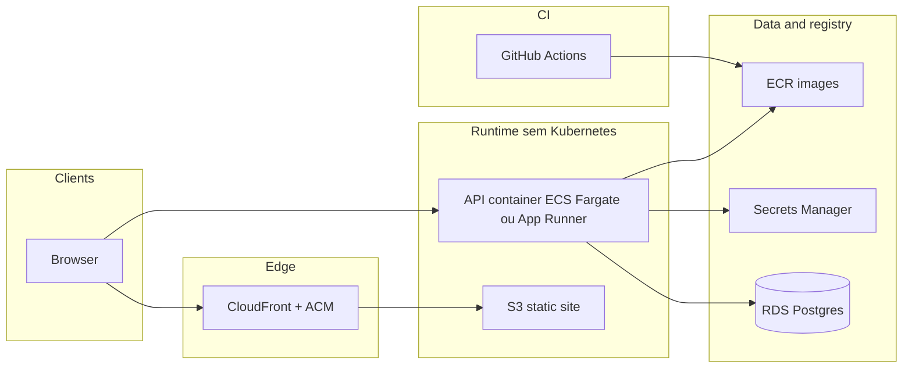

# Roteiro de deploy na AWS (Docker-first)

Este documento descreve o plano recomendado para levar o portfolio (API Go + SPA Vite) para a AWS com foco em baixo custo e baixa complexidade operacional:

1. Docker local (estado atual)
2. Docker em cloud (sem Kubernetes)
3. Kubernetes apenas se houver gatilhos reais de escala e organizacao

Os manifests Kubernetes em [`infra/k8s/README.md`](../../infra/k8s/README.md) continuam validos como trilha futura, nao como passo obrigatorio inicial.

Fora de escopo deste ficheiro: provisionar automaticamente conta AWS nem substituir IaC concreto (CDK, Terraform, CloudFormation). A recomendacao e validar primeiro o fluxo operacional simples e depois formalizar em IaC.

## Ligacoes uteis no repositorio

| Documento | Conteudo |
| --------- | -------- |
| [`README.md`](../../README.md) | Monorepo, Docker Compose, `VITE_API_BASE_URL`, Kubernetes em alto nivel |
| [`infra/docker/docker-compose.yml`](../../infra/docker/docker-compose.yml) | Stack local (postgres, API, web estatico) |
| [`apps/api/README.md`](../../apps/api/README.md) | Variaveis da API (`DATABASE_URL`, `CORS_ORIGINS`, `ADMIN_API_KEY`) |
| [`infra/k8s/README.md`](../../infra/k8s/README.md) | Referencia para evolucao futura em Kubernetes |

Imagens: [`apps/api/Dockerfile`](../../apps/api/Dockerfile) e [`apps/web/Dockerfile`](../../apps/web/Dockerfile). O URL da API visivel no browser e embutido no bundle com `VITE_API_BASE_URL` no build da imagem web.

## Diagrama de referencia (Docker em cloud)

## Pre-requisitos

- Conta AWS com permissoes para VPC, ECR, RDS, IAM, ECS/App Runner, Route 53 (opcional), ACM, CloudFront, S3 e Secrets Manager.
- Regiao escolhida de forma consistente.
- Dominio (opcional, recomendado) para TLS e URLs estaveis.
- Ferramentas: AWS CLI (`aws`), Docker.
- Decisao inicial de runtime da API (sem k8s):
  - Variante A: ECS Fargate (mais controle)
  - Variante B: App Runner (mais simples para iniciar)

O workflow atual [`.github/workflows/ci.yml`](../../.github/workflows/ci.yml) faz lint, test e build; ainda nao publica imagens nem faz deploy.

## Estrategia para manter custo baixo

Para este projeto, o maior impacto de custo tende a vir de runtime de containers, RDS, NAT Gateway e egress de CDN/rede.

Se o objetivo for poupar sem perder qualidade minima de producao:

1. Preferir SPA em S3 + CloudFront (sem container para estaticos).
2. Evitar NAT Gateway no inicio quando viavel, planeando rede e saida com cuidado.
3. Comecar pequeno no RDS (single-AZ, classe burstable, backups curtos).
4. Manter a API com 1 instancia no inicio e escalar por metrica real.
5. Aplicar retencao curta de logs (7-14 dias no inicio).

### Guardrails de custo

- Criar AWS Budgets com alertas em 50/80/100%.
- Aplicar tags obrigatorias (`project=portfolio`, `env`, `owner`).
- Revisao semanal no Cost Explorer.

## Fases sugeridas (ordem pratica)

### Fase 0. Base atual (Docker local)

- Continuar com `docker compose` para desenvolvimento e validacao local.
- Garantir `VITE_API_BASE_URL` correto por ambiente.
- Manter paridade minima de versao do Postgres local com producao (16.x).

### Fase 1. Rede e base (VPC)

- Criar/reutilizar VPC com subnets publicas e privadas conforme runtime escolhido.
- Planejar security groups com acesso ao banco apenas a partir da API.
- Nunca expor PostgreSQL para `0.0.0.0/0`.

### Fase 2. RDS PostgreSQL

- Provisionar RDS em subnets privadas.
- Usar `sslmode` adequado na `DATABASE_URL`.
- Armazenar segredos no Secrets Manager (nunca em git).
- Iniciar com single-AZ e tamanho conservador.

### Fase 3. ECR

- Criar repositorios `portfolio-api` e `portfolio-web`.
- Publicar imagens com tags imutaveis (SHA/semver).
- Restringir IAM por privilegio minimo.
- Definir lifecycle policy para limpeza de imagens antigas.

### Fase 4. CI/CD (GitHub Actions + OIDC)

- Adicionar job de release para:
  - login no ECR
  - build/push da API e web
  - build da web com `VITE_API_BASE_URL` final (browser-visible URL)
- Atualizar deploy da API no ECS/App Runner com tag imutavel.
- Automatizar upload do `dist/` no S3 e invalidacao do CloudFront.

### Fase 5. Runtime da API (sem Kubernetes)

Escolher um caminho:

- ECS Fargate: Task Definition + Service + autoscaling basico.
- App Runner: deploy direto da imagem do ECR.

Boas praticas:

- healthcheck em `/health`
- segredos via Secrets Manager
- minimo de capacidade no inicio
- escala baseada em CPU/memoria e erro/latencia

### Fase 6. DNS e TLS

- Route 53 (ou DNS externo) para CloudFront (front) e endpoint da API.
- Certificados ACM para front e API.

### Fase 7. Configuracao de app e CORS

- Definir `CORS_ORIGINS` com origem exata do front.
- Manter `DATABASE_URL` e `ADMIN_API_KEY` em segredo gerenciado.
- Como a API roda migracoes no startup, manter operacao conservadora no inicio.

### Fase 8. Pos-deploy

- Smoke tests: `GET /health` e envio do formulario de contato.
- Revisao de custos e ajuste de capacidade.
- Logs e alarmes basicos no CloudWatch.
- Validar backups e restore do RDS.

## Checklist rapido de menor custo (producao inicial)

- Frontend em S3 + CloudFront.
- API em ECS Fargate ou App Runner (sem EKS no inicio).
- RDS PostgreSQL single-AZ com sizing conservador.
- API com 1 instancia inicial e escala por medicao.
- Lifecycle no ECR e retencao enxuta no CloudWatch Logs.
- Budgets e alertas ativos desde o primeiro dia.

## Gatilhos para migrar para Kubernetes depois

Considere mover para EKS quando houver pelo menos 2 sinais:

- multiplos servicos e necessidade forte de padronizacao de plataforma
- requisitos avancados de rollout (canary/blue-green) e alta disponibilidade
- autoscaling horizontal frequente com operacao multiambiente mais complexa
- equipe com maturidade para operar cluster e observabilidade de producao

## Proximos passos opcionais

- Formalizar toda a infraestrutura em Terraform, CDK ou CloudFormation.
- Criar ambiente de staging completo no mesmo modelo Docker em cloud.
- Revisar trimestralmente custo x complexidade para decidir se k8s ainda e necessario.
