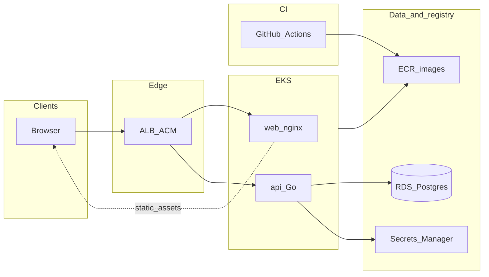

# Roteiro de deploy na AWS

Este documento é o **roteiro operacional** sugerido para levar o portfolio (API Go + SPA Vite) para a AWS. Os manifests Kubernetes continuam a ser a referência técnica em [`infra/k8s/README.md`](../../infra/k8s/README.md); aqui descreve-se ordem prática, decisões e pré-requisitos de conta e rede.

**Fora de escopo deste ficheiro:** provisionar automaticamente uma conta AWS nem substituir IaC concreto (CDK, Terraform, etc.). Pode listar-se IaC como próximo passo opcional após validar o fluxo manualmente.

## Ligações úteis no repositório

| Documento | Conteúdo |
| --------- | -------- |
| [`infra/k8s/README.md`](../../infra/k8s/README.md) | Kustomize, variáveis, Ingress, checklist ECR/EKS/RDS |
| [`README.md`](../../README.md) | Monorepo, Docker Compose, `VITE_API_BASE_URL`, Kubernetes em alto nível |
| [`apps/api/README.md`](../../apps/api/README.md) | Variáveis de ambiente da API (`DATABASE_URL`, `CORS_ORIGINS`, `ADMIN_API_KEY`, …) |

Imagens: [`apps/api/Dockerfile`](../../apps/api/Dockerfile) e [`apps/web/Dockerfile`](../../apps/web/Dockerfile) (contexto do build web = **raiz do monorepo**). O URL da API visível no browser é embutido no bundle com **`VITE_API_BASE_URL`** no build da imagem web.

O Ingress base está em [`infra/k8s/ingress.yaml`](../../infra/k8s/ingress.yaml) (`ingressClassName: nginx` por defeito; comentários para ALB no EKS).

## Diagrama de referência (fluxo)

## Pré-requisitos

- **Conta AWS** com permissões para VPC, EKS, ECR, RDS, IAM, (opcional) Route 53, ACM, Secrets Manager.
- **Região** escolhida de forma consistente (todos os recursos relacionados na mesma região, salvo requisitos específicos).
- **Domínio** (opcional mas recomendado) para TLS no ALB ou CloudFront e para URLs estáveis da API e do front.
- **Ferramentas:** AWS CLI (`aws`), `kubectl` configurado contra o cluster alvo, Docker para builds locais de validação.
- **Decisão inicial — onde servir o SPA:**
  - **Variante A — SPA no EKS (nginx):** alinhado aos manifests actuais (`portfolio-web` em Pod). Simples de alinhar com o que já existe; custo e gestão de Pods para ficheiros estáticos.
  - **Variante B — S3 + CloudFront:** servir o `dist/` do Vite a partir de S3 atrás de CloudFront; só a API no EKS. Costuma reduzir custo e simplificar escala de estáticos; continua a ser necessário `VITE_API_BASE_URL` apontando para a API pública e `CORS_ORIGINS` na API a coincidir com o domínio CloudFront (ou custom). Esta variante já é mencionada em [`infra/k8s/README.md`](../../infra/k8s/README.md).

O workflow de CI actual ([`.github/workflows/ci.yml`](../../.github/workflows/ci.yml)) faz lint, test e build; **não** inclui `docker build` nem push para registo — isso entra na fase CI/CD abaixo.

---

## Fases sugeridas (ordem prática)

### 1. Rede e base (VPC)

- Criar ou reutilizar **VPC** com subnets **públicas** (ALB, NAT se necessário) e **privadas** (nós EKS, RDS).
- Escolher **AZs** (por exemplo duas ou três) e **alinhar subnets** que vão receber o cluster EKS e a instância RDS (RDS tipicamente só em subnets privadas).
- Planear security groups: regra de entrada na base de dados **apenas** a partir do cluster EKS (security group dos nós ou do cluster), nunca `0.0.0.0/0` na porta PostgreSQL.

### 2. RDS PostgreSQL

- Versão de motor alinhada ao ambiente local (Compose usa PostgreSQL **16** — ver [`README.md`](../../README.md) e Compose em `infra/docker`).
- Colocar o RDS em **subnets privadas**; **security group** com inbound só desde o EKS.
- `DATABASE_URL` com **`sslmode`** adequado ao RDS (por exemplo `require` ou o modo que a política de segurança exigir).
- **Não** commitar credenciais: guardar a connection string no **Secrets Manager** (ou SSM) e injetar no cluster com **External Secrets Operator** (recomendado) ou fluxo manual inicial (`kubectl create secret` a partir de um pipeline seguro).
- Referência de variáveis da API: [`apps/api/README.md`](../../apps/api/README.md).

### 3. ECR

- Criar repositórios, por exemplo **`portfolio-api`** e **`portfolio-web`**, na região alvo.
- **IAM com privilégio mínimo** para CI (push) e para nós EKS (pull).
- Preferir **tags imutáveis** (por exemplo SHA do commit) e referenciar a mesma tag nos Deployments ou via Kustomize `images:` (ver [`infra/k8s/README.md`](../../infra/k8s/README.md)).

### 4. CI/CD (GitHub Actions + OIDC)

- Estender o CI com um job em **`main`** (ou workflow dedicado `release`) que use **OIDC para AWS** (sem credenciais longas em secrets estáticos, quando possível).
- Passos típicos: login no ECR, `docker build` e `docker push` das duas imagens.
- No build da imagem web, passar **`VITE_API_BASE_URL`** como **build-arg** a partir de **secret** ou **variável de repositório** do GitHub, com o URL **final** que o browser usará para chamar a API (por exemplo `https://api.example.com`).
- Após o push, actualizar o cluster (`kubectl set image`, GitOps, etc.) conforme [`infra/k8s/README.md`](../../infra/k8s/README.md).

### 5. EKS

- Criar cluster **EKS** com **node groups** ou **Fargate**, na mesma VPC/subnet strategy do RDS.
- Instalar add-ons necessários (CNI, etc.) segundo a documentação AWS/EKS.
- Instalar o **AWS Load Balancer Controller** para expor serviços com **ALB Ingress**.
- Ajustar o **Ingress**: em [`infra/k8s/ingress.yaml`](../../infra/k8s/ingress.yaml) está `ingressClassName: nginx` e comentários para annotations ALB; em produção AWS, usar overlay Kustomize ou patches com **IngressClass** do ALB e annotations (`scheme`, `target-type`, certificado ACM, …). Garantir que worker nodes (ou Fargate) **puxam imagens do ECR** e **alcançam o RDS** na porta da base de dados.

### 6. DNS e TLS

- **Route 53** (ou DNS externo) com registos apontando para o **ALB** (ou para CloudFront na variante estática do front).
- Certificado **ACM** associado ao listener HTTPS do ALB (ou ao CloudFront).

### 7. ConfigMap, Secrets, CORS e réplicas da API

- **ConfigMap** (`CORS_ORIGINS`): definir a **origem exacta** do front no browser (URL pública do SPA), não wildcards genéricos em produção. Ver [`infra/k8s/configmap.yaml`](../../infra/k8s/configmap.yaml) e [`apps/api/README.md`](../../apps/api/README.md).
- **Secret:** `DATABASE_URL` e opcionalmente **`ADMIN_API_KEY`** — valores reais apenas via Secret/Secrets Manager, não em git ([`infra/k8s/secret.yaml`](../../infra/k8s/secret.yaml) usa placeholders).
- A API corre **migrações ao arranque**; manter **réplica única** da API até existir estratégia explícita para migrações com múltiplas réplicas (Job de migração, leader election, etc.), como já está notado no README do K8s.

### 8. Pós-deploy

- **Smoke tests:** `GET /health`, envio do formulário de contacto (fluxo real browser → API).
- Rever **custos** (EKS, RDS, tráfego, NAT).
- **Logs:** agregação para CloudWatch (ou stack de observabilidade escolhida).
- **Backups RDS** e política de retenção/restauro.

---

## Próximos passos opcionais

- Formalizar toda a infraestrutura em **Terraform**, **CDK** ou **CloudFormation** para repetibilidade e revisão por PRs.
- Na variante **S3 + CloudFront**, automatizar upload do `dist/` e invalidação de cache no pipeline, mantendo a API no EKS com os mesmos cuidados de segredo e CORS.
